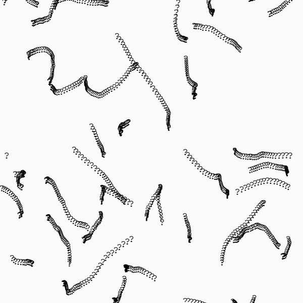
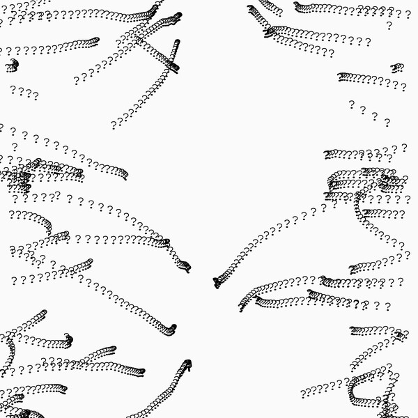
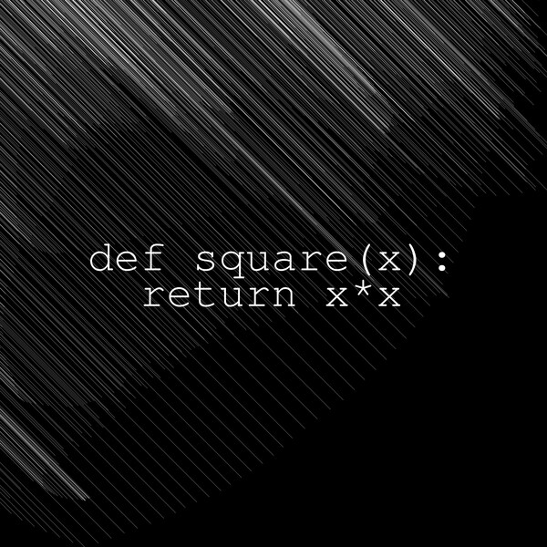
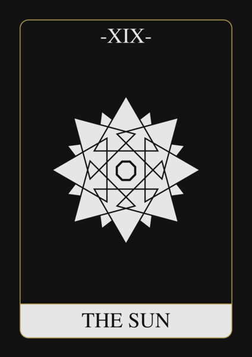
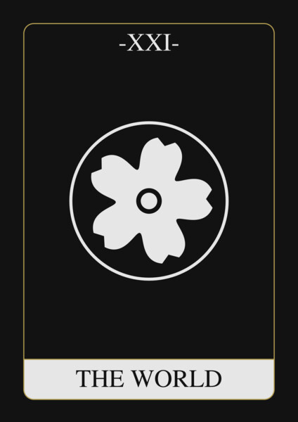
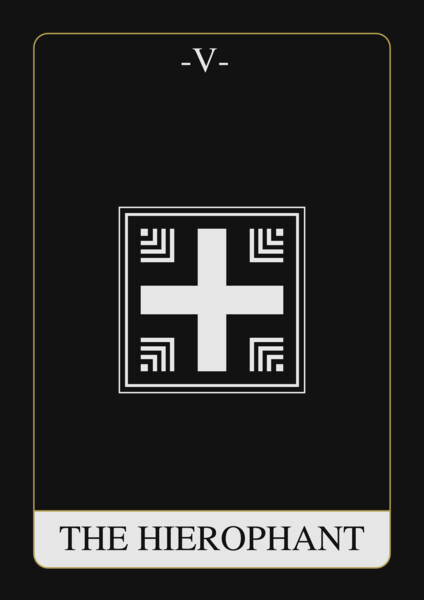
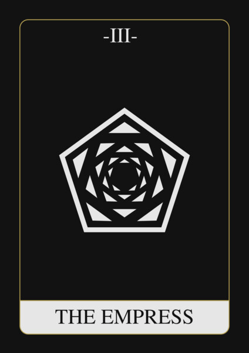
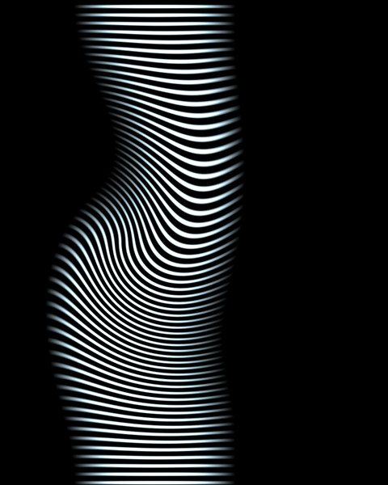
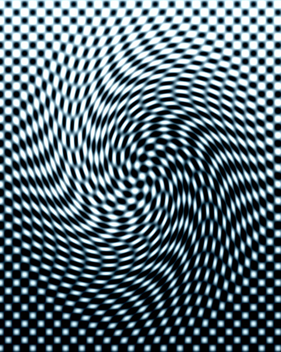

# sketches

These are some visual sketches I made while learning about digital art.

## Captures

### Code of Nature

  
  
  
  

### PixelSpirit Deck

  
  
  
  

### ImageMagick

  
  

## Restrictions

~~I won't develop a framework for this repo. I'll stick to the features the techstack I am experimenting with has.~~ lol

## Postscript Notes

- Missing features: normal distribution, noise functions (1D or 2D), vectors and vector ops.
- line width grows outside of what the geometry would fill
- *stringwidth* assumes every character is the same width

## References

- [Nature of Code](https://natureofcode.com/)
- [PixelSpirit Elements Deck](https://pixelspiritdeck.com/)
